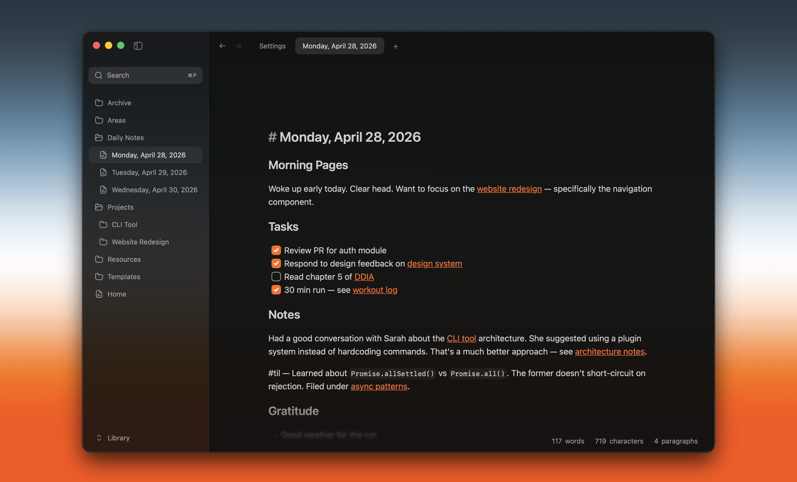

# Memento

A fast, local-first editor for the markdown files in your workspace — Obsidian-like, but tailored for a git repo it syncs, pushes, and pulls like a code editor.



## Why I made this

I wanted to give my [Poke](https://poke.com) bot a memory layer — a place it could finally save things that lasts.

The obvious first option is Poke's own built-in memory. But anyone who's used it knows it kind of sucks — it forgets things, constantly.

So I pointed Poke at a private GitHub repo. Now it has a place to write — save a memory, come back later, append, edit.

Memento is the editor for that repo — an Obsidian-style app where the workspace _is_ a git repo, syncing as the agent writes. The agent is the primary writer; I mostly read, and sometimes edit.

> **Fun fact:** _memento_ is Latin for "remember" — fitting for an app whose whole job is helping something remember.

See [`SPECs/github-sync-spec.md`](./SPECs/github-sync-spec.md) for how the sync layer works.

## What it does

- Opens a workspace folder of markdown files, kept on disk as plain text.
- Clones a GitHub repo as that workspace, auto-fetches remote changes, and pushes local edits from a subtle status-bar sync control.
- A Source Control view lists working-tree changes, shows per-file diffs, and renders a commit-activity heatmap from local git history.
- Renders extended markdown — tables, Mermaid diagrams — respects workspace `.gitignore` rules, supports multiple windows, and ships with a signed macOS release flow.

## Repository

- `apps/desktop/` — Tauri desktop app.
- `apps/desktop/src/` — React frontend.
- `apps/desktop/src-tauri/src/` — Rust commands, workspace state, watcher, updater, and CLI integration.
- `docs/` — project and agent workflow docs.
- `SPECs/` — feature specs and design notes.

## Development

This repo uses Vite+ through the `vp` CLI. Use `vp` instead of calling the package manager or Vite tooling directly.

```bash
vp install
vp dev
```

## Validation

```bash
vp check
vp test
```

Rust validation runs from the Tauri crate:

```bash
cd apps/desktop/src-tauri
cargo test
cargo clippy
cargo fmt --check
```

## Releases

macOS releases are cut locally with `scripts/distribute.sh`. See `docs/releasing.md` for the signed, notarized release workflow and updater publishing details.

## Credits

Memento is a fork of [**writer-computer**](https://github.com/joelbqz/writer-computer) by [Joel](https://github.com/joelbqz) — the local-first markdown editor that made all of this possible. The GitHub-sync memory layer is built on top of his work. Huge thanks to him for the foundation.

Built with Tauri v2, React, Zustand, CodeMirror, and Rust.
